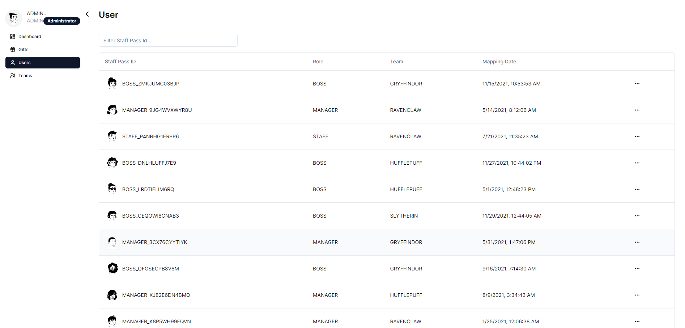

<a name="readme-top"></a>

<!-- PROJECT SHIELDS -->
<!--
*** I'm using markdown "reference style" links for readability.
*** Reference links are enclosed in brackets [ ] instead of parentheses ( ).
*** See the bottom of this document for the declaration of the reference variables
*** for contributors-url, forks-url, etc. This is an optional, concise syntax you may use.
*** https://www.markdownguide.org/basic-syntax/#reference-style-links
-->

<!-- PROJECT LOGO -->
<br />
<div align="center">
  <a href="https://[github.com/insight-sg/insight-mobile](https://github.com/kjh-bryan/gift-redemption-app)">
    
  </a>

<h3 align="center">Gift Redemption App</h3>

   <p align="center">
     This is a NextJS + Node.js and TypeScript-based system designed for managing team gift redemption within a department during the Christmas season. It allows representatives from each team to redeem their gifts, ensuring fairness and eligibility verification.
    <br />
   <!-- <a href="">View Demo</a> -->
  </p>
</div>

<!-- ABOUT THE PROJECT -->

## About The Project

During the Christmas season, distributing gifts to teams within a department is a common practice. However, it's essential to manage the process efficiently and fairly. This system provides a solution for this purpose.

## Features

- NextJS(Frontend) + NodeJS(Backend) + PostgreSQL(Database)
- Fullstack Authentication with JWT & [Zod Validation](https://zod.dev/)
  - Login/Register Screen
    - Lookup Team using Staff Pass ID
  - Dashboard Screen
  - Gift Screen
    - Redemption Verification
    - Redeem Gift
  - Users Screen (Admin)
    - Display Users
    - Change User Team
    - Delete User
  - Teams Screen (Admin)
    - Display Teams
    - Change Team Name
    - Create New Team

### Built With

- [![Express][express.dev]][express-url]
-  Hosted on 
- [![NodeJS][node.dev]][node-url] Hosted on 
-  Hosted on 
- 
- 
- 

### Additional Features

- [![JWT][jwt.dev]][jwt-url]
- 


### Linters

- [![ESLint][eslint.dev]][eslint-url]
- [![Prettier][prettier.dev]][prettier-url]

### Testing
- 

### Screens

## Login/Register

| Login Screen                                 |
| -------------------------------------------- |
|  |

| Register Screen                                 |
| ----------------------------------------------- |
|  |

| Register Screen Role                                 |
| ---------------------------------------------------- |
|  |

| Register Screen Team                                 |
| ---------------------------------------------------- |
|  |

| Register Screen Successful                                 |
| ---------------------------------------------------------- |
|  |

## Admin

| Admin Dashboard Screen                                 |
| ------------------------------------------------------ |
|  |

| Admin Gift Screen                                 |
| ------------------------------------------------- |
|  |

| Admin Create Gift                                            |
| ------------------------------------------------------------ |
|  |

| Admin Create Gift Successful                                         |
| -------------------------------------------------------------------- |
|  |

| Admin User Screen                                       |
| -------------------------------------------------------------------- |
|  |

| Admin Search User By Staff ID                                       |
| -------------------------------------------------------------------- |
|  |

| Admin User Screen Actions (Change Team, Delete User)                                     |
| -------------------------------------------------------------------- |
|  |

| Admin Change User's Team                                   |
| -------------------------------------------------------------------- |
|  |

| Admin Delete User                                 |
| -------------------------------------------------------------------- |
|  |

| Admin Team Screen (Update Team Name, Create Team)                |
| -------------------------------------------------------------------- |
|  |

| Admin Update Team Name                                |
| -------------------------------------------------------------------- |
|  |

| Admin Create Team                                  |
| -------------------------------------------------------------------- |
|  |

## User (Unassigned Team)

| User Dashboard (General)                         |
| ------------------------------------------------ |
|  |

| User Gift Screen                                             |
| ------------------------------------------------------------ |
|  |

## User (Assigned Team)

| User Gift Screen                                           |
| ---------------------------------------------------------- |
|  |

| User Redeem Gift                                        |
| ------------------------------------------------------- |
|  |

## API Endpoints (Tasks)

| Get Staff Mapping (Tasks 1)                                |
| ------------------------------------------------ |
|  |

| Verify Redemption  (Tasks 2)                                   |
| -------------------------------------------------- |
|  |

| Redeem Gift (Tasks 3)             |
| -------------------------------------------- |
|  |

| Redemption Data  (Tasks 3)                   |
| --------------------------------------------------------- |
||
|  |

## Unit Tests 

| NodeJS Backend                  |
| --------------------------------------------------------- |
|  |

## ERD Diagram
| dbdiagram.io               |
| --------------------------------------------------------- |
| |


To have a better view of Gift Redemption App's functionalities, please visit this live [website](https://gift-redemption-app.vercel.app/).

Please take note while trying out due to limited resources, request from backend may be delayed


## Getting Started

Required to download:

- NodeJS -> https://nodejs.org/en
- PostgreSQL -> https://www.postgresql.org/download/

## Guides on Installation

- Setting Up PostgreSQL -> https://www.youtube.com/watch?v=IYHx0ovvxPs

### Installation

1. Clone the repo
   ```sh
   git clone https://github.com/kjh-bryan/gift-redemption-app.git
   ```
2. Install packages
   ```sh
   cd gift-redemption-app/ &&  npm install ./backend && npm install ./frontend
   ```
3. Create .env files in both backend and frontend folder

   - backend/.env
     ```sh
     NODE_ENV=production
     JWT_SECRET=SECRET
     PORT=5000
     POSTGRESQL_HOST=localhost
     POSTGRESQL_PORT=5432
     POSTGRESQL_DB = postgres
     POSTGRESQL_USERNAME = postgres
     POSTGRESQL_PASSWORD= yourpostgrespassword
     ```
   - frontend/.env
     ```sh
     NEXTAUTH_SECRET=somereallysecretsecret
     NEXT_PUBLIC_BACKEND_URL=http://localhost:5000
     ```

4. Run NodeJS Backend Server
   Make sure you're in the backend folder

   ```js
   npm run dev
   ```

   The server will then create tables automatically for you.

   Servers > PostgreSQL > Databases > postgres > Schemas > public > Tables

   

   After the tables are created, the tables will be populated with the data from `staff-id-to-team-mapping-long.csv` at `/data`

5. Run NextJS
   Make sure you're in the frontend folder
   ```js
   npm start
   ```

## Assumptions

- Single Team Redemption: Each team can only redeem one gift, and once redeemed, they cannot redeem another gift. This assumption aligns with the task's requirement that "each team can send any representative to redeem their team's gift." This implies that once a team has redeemed its gift, subsequent attempts by any representative from the same team would be denied.
- Authentication and Authorization: Authentication and authorization are necessary for accessing the system and performing actions such as redeeming gifts or modifying user/team data. This is indicated by the use of JWT (JSON Web Tokens) for authentication and the presence of admin functionalities for managing users and teams.
- Database Storage: PostgreSQL as the database system for storing data related to users, teams, and redemptions. Assuming a relational data model would be suitable for the application's requirements as it provides robust support for maintaining data integrity and enforcing relationships between different entities (such as users, teams, and redemptions). This is crucial for ensuring that each user is associated with only one team and that redemptions are linked accurately to their respective teams.
- Timestamp Handling: Timestamp information is crucial for tracking when mapping records were added and when redemptions occurred. This is evident from the task's requirement to compare timestamps for verifying eligibility and adding new redemptions. Therefore, storing timestamps in the database for consistency and ease of comparison.
- Frontend-Backend Separation: Separated the frontend (Next.js) from the backend (Node.js) to enhance modularity and maintainability. This division allows for easier scaling and future modifications, as changes to one component (e.g., frontend UI) would not directly impact the other (e.g., backend logic).
- Error Handling: To have the necessity of error handling mechanisms, including validation of user input, handling of database errors, and providing meaningful error messages to users. This ensures the robustness and reliability of the application.
- Miscellaneous
  - staff_pass_id is used as username, while team_name is hashed and used as password
  - Username can be ROLE_username or just username without ROLE (Login)

<p align="right">(<a href="#readme-top">back to top</a>)</p>

## Roadmap

- [x] Login Screen
- [x] Register Screen
- [x] Dashboard Screen
- [x] Gift Screen
- [x] Admin Actions
  - [x] Users Screen
  - [x] Teams Screen

<p align="right">(<a href="#readme-top">back to top</a>)</p>

## Contact

Bryan Kang - [Github](https://github.com/kjh-bryan)

<p align="right">(<a href="#readme-top">back to top</a>)</p>

[splash]: images/splash.png
[signin]: images/signin_screen.png
[register]: images/register_screen.png
[search]: images/search_screen.png
[result]: images/result_screen.png
[history]: images/history_screen.png
[azure]: https://img.shields.io/badge/azure-%230072C6.svg?style=for-the-badge&logo=microsoftazure&logoColor=white
[mongodb-url]: https://www.mongodb.com/atlas/database
[express.dev]: https://img.shields.io/badge/Express.js-000000?style=for-the-badge&logo=express&logoColor=white
[express-url]: https://expressjs.com/
[reactnative.dev]: https://img.shields.io/badge/React_Native-20232A?style=for-the-badge&logo=react&logoColor=61DAFB
[reactnative-url]: https://reactnative.dev/
[node.dev]: https://img.shields.io/badge/Node.js-339933?style=for-the-badge&logo=nodedotjs&logoColor=white
[node-url]: https://nodejs.org/
[googlecloud.dev]: https://img.shields.io/badge/Google_Cloud-4285F4?style=for-the-badge&logo=google-cloud&logoColor=white
[googlecloud-url]: https://cloud.google.com/
[jwt.dev]: https://img.shields.io/badge/JWT-000000?style=for-the-badge&logo=JSON%20web%20tokens&logoColor=white
[jwt-url]: https://jwt.io/
[devpost]: https://img.shields.io/badge/Devpost-003E54?style=for-the-badge&logo=Devpost&logoColor=white
[devpost-url]: https://atlasmadness.devpost.com/
[eslint.dev]: https://img.shields.io/badge/eslint-3A33D1?style=for-the-badge&logo=eslint&logoColor=white
[eslint-url]: https://eslint.org/
[prettier.dev]: https://img.shields.io/badge/prettier-1A2C34?style=for-the-badge&logo=prettier&logoColor=F7BA3E
[prettier-url]: https://prettier.io/
[ts-node.dev]: https://img.shields.io/badge/ts--node-3178C6?style=for-the-badge&logo=ts-node&logoColor=white
[ts-node-url]: https://github.com/TypeStrong/ts-node
[expo.dev]: https://img.shields.io/badge/Expo-1B1F23?style=for-the-badge&logo=expo&logoColor=white
[expo-url]: https://expo.dev/
