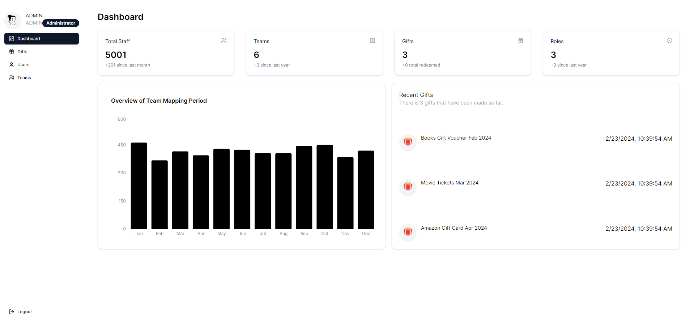
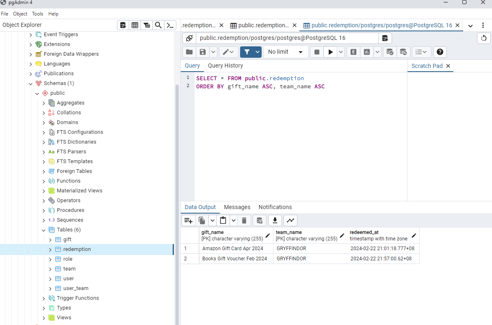

<a name="readme-top"></a>

<!-- PROJECT SHIELDS -->
<!--
*** I'm using markdown "reference style" links for readability.
*** Reference links are enclosed in brackets [ ] instead of parentheses ( ).
*** See the bottom of this document for the declaration of the reference variables
*** for contributors-url, forks-url, etc. This is an optional, concise syntax you may use.
*** https://www.markdownguide.org/basic-syntax/#reference-style-links
-->

<!-- PROJECT LOGO -->
<br />
<div align="center">
  <a href="https://[github.com/insight-sg/insight-mobile](https://github.com/kjh-bryan/gift-redemption-app)">
    
  </a>

<h3 align="center">Gift Redemption App</h3>

   <p align="center">
     This is a NextJS + Node.js and TypeScript-based system designed for managing team gift redemption within a department during the Christmas season. It allows representatives from each team to redeem their gifts, ensuring fairness and eligibility verification.
    <br />
   <!-- <a href="">View Demo</a> -->
  </p>
</div>

<!-- ABOUT THE PROJECT -->

## About The Project

During the Christmas season, distributing gifts to teams within a department is a common practice. However, it's essential to manage the process efficiently and fairly. This system provides a solution for this purpose.

## Features

- NextJS(Frontend) + NodeJS(Backend)
- Fullstack Authentication with JWT
  - Login/Register Screen
    - Lookup Team using Staff Pass ID
  - Dashboard Screen
  - Gift Screen
    - Redemption Verification
    - Redeem Gift

### Built With

- [![Express][express.dev]][express-url]
-  Hosted on 
- [![NodeJS][node.dev]][node-url] Hosted on (https://render.com)
- 
- 

### Additional Features

- [![JWT][jwt.dev]][jwt-url]

### Linters

- [![ESLint][eslint.dev]][eslint-url]
- [![Prettier][prettier.dev]][prettier-url]

### Screens

## Login/Register

| Login Screen                                 |
| -------------------------------------------- |
|  |

| Register Screen                                 |
| ----------------------------------------------- |
|  |

| Register Screen Role                                 |
| ---------------------------------------------------- |
|  |

| Register Screen Team                                 |
| ---------------------------------------------------- |
|  |

| Register Screen Successful                                 |
| ---------------------------------------------------------- |
|  |

## Admin

| Admin Dashboard Screen                                 |
| ------------------------------------------------------ |
|  |

| Admin Gift Screen                                 |
| ------------------------------------------------- |
|  |

| Admin Create Gift                                            |
| ------------------------------------------------------------ |
|  |

| Admin Create Gift Successful                                         |
| -------------------------------------------------------------------- |
|  |

## User (Unassigned Team)

| User Dashboard (General)                         |
| ------------------------------------------------ |
|  |

| User Gift Screen                                             |
| ------------------------------------------------------------ |
|  |

## User (Assigned Team)

| User Gift Screen                                           |
| ---------------------------------------------------------- |
|  |

| User Redeem Gift                                        |
| ------------------------------------------------------- |
|  |

## API Endpoints

| Get Staff Mapping                                |
| ------------------------------------------------ |
|  |

| Verify Redemption                                  |
| -------------------------------------------------- |
|  |

| Redeem Gift                                  |
| -------------------------------------------- |
|  |

| Redemption Data                                           |
| --------------------------------------------------------- |
|  |

To have a better view of Gift Redemption App's functionalities, please visit this live [website](https://gift-redemption-app.vercel.app/).
Please take note while trying out due to limited resources, request from backend may be delayed


## Getting Started

Required to download:

- NodeJS -> https://nodejs.org/en
- PostgreSQL -> https://www.postgresql.org/download/

## Guides on Installation

- Setting Up PostgreSQL -> https://www.youtube.com/watch?v=IYHx0ovvxPs

### Installation

1. Clone the repo
   ```sh
   git clone https://github.com/kjh-bryan/gift-redemption-app.git
   ```
2. Install packages
   ```sh
   cd gift-redemption-app/ &&  npm install ./backend && npm install ./frontend
   ```
3. Create .env files in both backend and frontend folder

   - backend/.env
     ```sh
     NODE_ENV=production
     JWT_SECRET=SECRET
     PORT=5000
     POSTGRESQL_HOST=localhost
     POSTGRESQL_PORT=5432
     POSTGRESQL_DB = postgres
     POSTGRESQL_USERNAME = postgres
     POSTGRESQL_PASSWORD= yourpostgrespassword
     ```
   - frontend/.env
     ```sh
     NEXTAUTH_SECRET=somereallysecretsecret
     NEXT_PUBLIC_BACKEND_URL=http://localhost:5000
     ```

4. Run NodeJS Backend Server
   Make sure you're in the backend folder

   ```js
   npm run dev
   ```

   The server will then create tables automatically for you.

   Servers > PostgreSQL > Databases > postgres > Schemas > public > Tables

   

   After the tables are created, the tables will be populated with the data from `staff-id-to-team-mapping-long.csv` at `/data`

5. Run NextJS
   Make sure you're in the frontend folder
   ```js
   npm start
   ```

## Assumptions

- staff_pass_id is used as username, while team_name is hashed and used as passsword
- Gifts are unique to the team
- Username will always start with ROLE_username

<p align="right">(<a href="#readme-top">back to top</a>)</p>

## Roadmap

- [x] Login Screen
- [x] Register Screen
- [x] Dashboard Screen
- [x] Gift Screen

<p align="right">(<a href="#readme-top">back to top</a>)</p>

## Contact

Bryan Kang - [Github](https://github.com/kjh-bryan)

<p align="right">(<a href="#readme-top">back to top</a>)</p>

[splash]: images/splash.png
[signin]: images/signin_screen.png
[register]: images/register_screen.png
[search]: images/search_screen.png
[result]: images/result_screen.png
[history]: images/history_screen.png
[azure]: https://img.shields.io/badge/azure-%230072C6.svg?style=for-the-badge&logo=microsoftazure&logoColor=white
[mongodb-url]: https://www.mongodb.com/atlas/database
[express.dev]: https://img.shields.io/badge/Express.js-000000?style=for-the-badge&logo=express&logoColor=white
[express-url]: https://expressjs.com/
[reactnative.dev]: https://img.shields.io/badge/React_Native-20232A?style=for-the-badge&logo=react&logoColor=61DAFB
[reactnative-url]: https://reactnative.dev/
[node.dev]: https://img.shields.io/badge/Node.js-339933?style=for-the-badge&logo=nodedotjs&logoColor=white
[node-url]: https://nodejs.org/
[googlecloud.dev]: https://img.shields.io/badge/Google_Cloud-4285F4?style=for-the-badge&logo=google-cloud&logoColor=white
[googlecloud-url]: https://cloud.google.com/
[jwt.dev]: https://img.shields.io/badge/JWT-000000?style=for-the-badge&logo=JSON%20web%20tokens&logoColor=white
[jwt-url]: https://jwt.io/
[devpost]: https://img.shields.io/badge/Devpost-003E54?style=for-the-badge&logo=Devpost&logoColor=white
[devpost-url]: https://atlasmadness.devpost.com/
[eslint.dev]: https://img.shields.io/badge/eslint-3A33D1?style=for-the-badge&logo=eslint&logoColor=white
[eslint-url]: https://eslint.org/
[prettier.dev]: https://img.shields.io/badge/prettier-1A2C34?style=for-the-badge&logo=prettier&logoColor=F7BA3E
[prettier-url]: https://prettier.io/
[ts-node.dev]: https://img.shields.io/badge/ts--node-3178C6?style=for-the-badge&logo=ts-node&logoColor=white
[ts-node-url]: https://github.com/TypeStrong/ts-node
[expo.dev]: https://img.shields.io/badge/Expo-1B1F23?style=for-the-badge&logo=expo&logoColor=white
[expo-url]: https://expo.dev/
